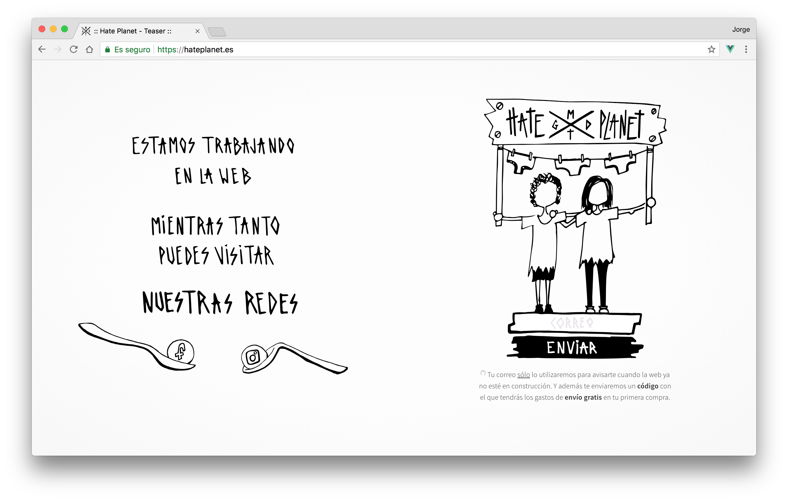
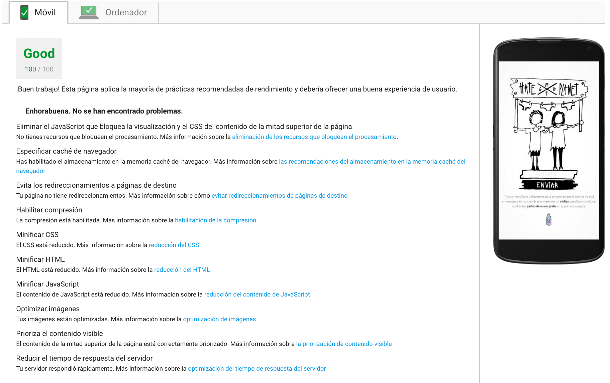

# 

  🎊  
  ✨ <b><a href="https://hateplanet.es"><small><i> Live teaser website</i></small></a> </b> ✨      

This repository contains the source code of the teaser website made for the artistic collective [Hate Planet]. This is developed with **Vue.js** in the Front-end and **Webpack** as a module bundler/build optimizer. It also implements a very straightforward ~tiny database service that stores emails with the **Firebase Realtime Database** and deployments are managed using **Firebase Hosting** which serves a Single Page Application through HTTPS.

 

  
Performance Best Practices - Google PageSpeed Tool

   
  
  🚀

 

## Contributing

I'd love that you contribute to this project so feel free to dive in. Open a new [issue](https://github.com/whoisjorge/hateplanet-teaser/issues/new) or just submit PRs. Don't be afraid to say whatever comes to mind 👌

<!-- Thanks for watching! -->
  

 🎩 
  <a href="http://www.whoisjorge.me">@whoisjorge</a>
   
  Copyright (c) 2017 <a href="https://hateplanet.es">Hate Planet</a>

[Hate Planet]: https://www.instagram.com/hate.x.planet/
